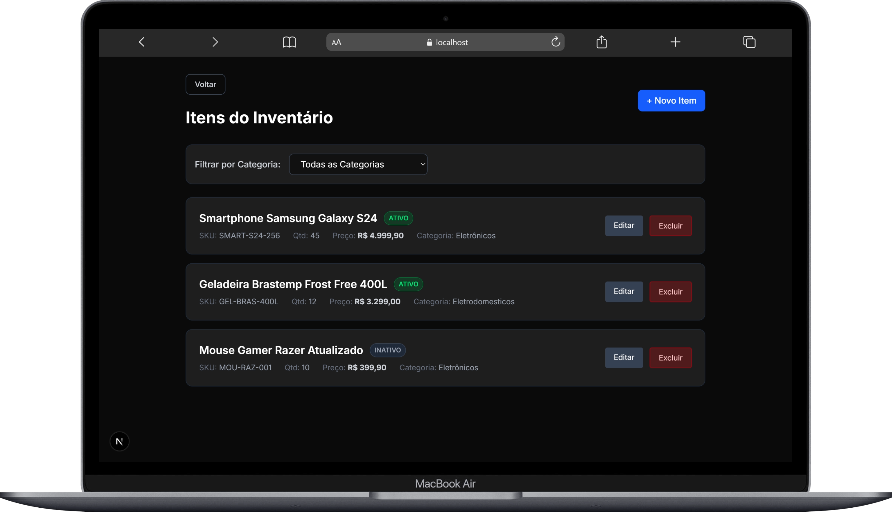

# Front-end - Gestão de Inventário

Interface Web desenvolvida em **React** e **Next.js** para consumir a API de gerenciamento de Categorias e Itens de um inventário.



## Tecnologias Utilizadas
* **React 19**
* **Next.js 16** (App Router)
* **TypeScript**
* **Tailwind CSS** (Estilização baseada em layout Dark Mode)
* **Axios** (Integração e consumo da API)
* **React Hot Toast** (Feedback visual e notificações)

## Estrutura e Arquitetura

A aplicação foi estruturada focando na componentização e experiência do usuário (UX):
* **App Router (`src/app`):** Roteamento nativo e simplificado do Next.js organizando as telas de Categorias e Itens.
* **Services (`src/services/api.ts`):** Configuração centralizada do Axios apontando para a API local, facilitando a manutenção e tratamento de erros.
* **UX/UI:** Aplicação focada em usabilidade, contendo confirmações de exclusão, estados de carregamento (loading) nos botões e validação de formulários.

---

## Como rodar o projeto localmente

### 1. Pré-requisitos
* **Node.js** (versão 18 ou superior) instalado na máquina.
* A **API REST (Backend)** precisa estar em execução localmente, na porta padrão `8080`. *(Nota: Se a sua API estiver rodando em outra porta, você deve alterar a URL base no arquivo `src/services/api.ts`).*

### 2. Iniciando a Interface Web
Após baixar/clonar o repositório, abra o terminal na raiz do projeto e siga os passos abaixo:

Instale as dependências do projeto:
```bash
npm install
```

Inicie o servidor de desenvolvimento:
```bash
npm run dev
```

A interface estará disponível no navegador em: `http://localhost:3000`

---

## Funcionalidades da Interface

### Categorias (`/categorias`)
* **Listagem:** Visualização de todas as categorias cadastradas.
* **Cadastro/Edição:** Formulários dinâmicos e validados para inserção e atualização de dados.
* **Exclusão Segura:** Confirmação em tela antes de deletar e exibição de erro caso a categoria possua itens vinculados (validação da API).

### Itens (`/itens`)
* **Listagem:** Visualização detalhada dos itens contendo formatação de moeda local (R$) e badges dinâmicos de Status (Ativo/Inativo).
* **Filtro Inteligente:** Select dinâmico para listar e filtrar itens por uma categoria específica.
* **Cadastro/Edição:** Formulários integrados que buscam as categorias do banco de dados para compor o dropdown de seleção.

---

## Integração

Este projeto representa exclusivamente a camada Front-end. Todas as regras de negócio, persistência de dados e segurança estão contidas no repositório do Back-end.

Para consultar as rotas consumidas por esta interface, acesse a documentação oficial da API no Postman:

**[Acessar Documentação no Postman](https://documenter.getpostman.com/view/48074793/2sBXcEkLWC)**

---

## Autor

**[Marcelo Vieira](https://www.linkedin.com/in/marcelovieirasilva/)**