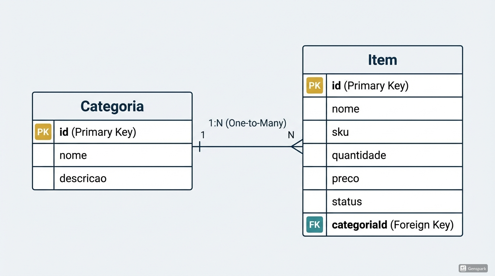

# Back-end — Spring Boot + Java

## 🎯 Missão
Criar as APIs REST para gerenciar **Categorias** e **Itens** de inventário.

Basea-se no design https://inventario-mea3kquj.manus.space/items

### APIs de Categorias
- `POST /api/categories` - Criar categoria
- `GET /api/categories` - Listar todas
- `GET /api/categories/{id}` - Buscar por ID
- `PUT /api/categories/{id}` - Atualizar
- `DELETE /api/categories/{id}` - Deletar

### APIs de Itens
- `POST /api/items` - Criar item (categoriaId obrigatório)
- `GET /api/items` - Listar todos
- `GET /api/items/{id}` - Buscar por ID
- `PUT /api/items/{id}` - Atualizar
- `DELETE /api/items/{id}` - Deletar
- `GET /api/items?categoriaId={id}` - Filtrar por categoria

## ✅ Requisitos Importantes
- Item sem categoria deve retornar erro 400
- Categoria inexistente deve retornar erro 400
- Códigos HTTP corretos (200, 201, 204, 400, 404)
- Validações de campos obrigatórios
- Tratamento ao deletar categoria com itens vinculados

## 🔧 Stack Técnica
- Java 21+
- Spring Boot
- PostgreSQL
- Maven ou Gradle

## 📦 Entrega
1. Fork este repositório
2. Implemente as APIs
3. Envie o link do seu repo

## 📊 Relacionamento dos Dados
**1 Categoria → N Itens**  
- Uma categoria pode ter vários itens
- Um item pertence a apenas uma categoria (obrigatório)

